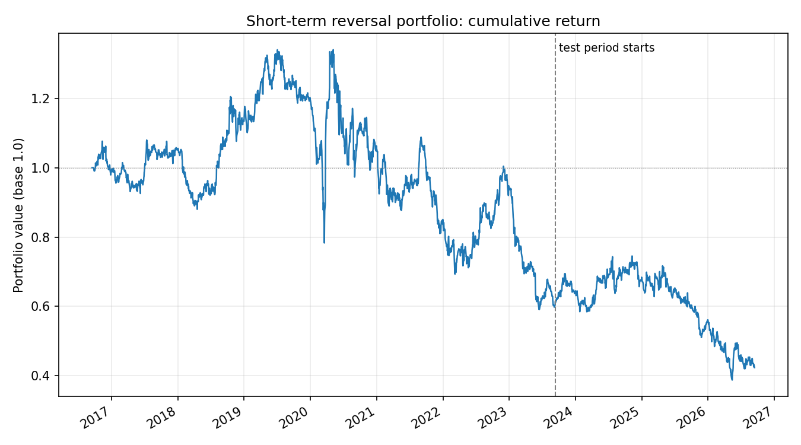
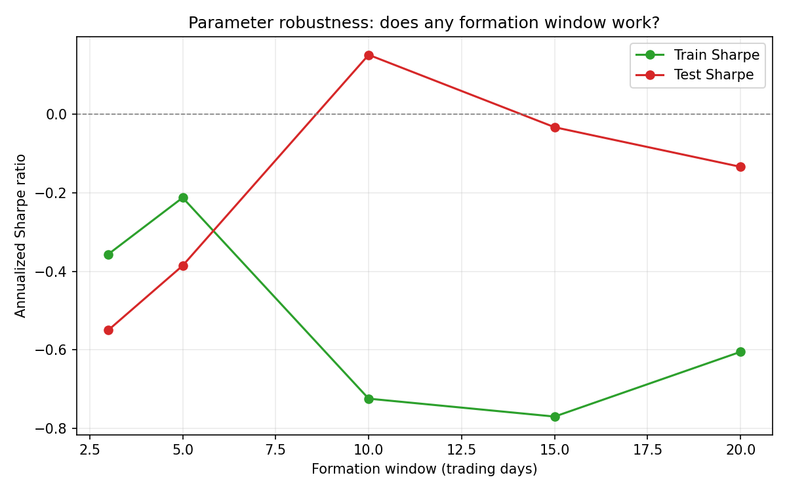
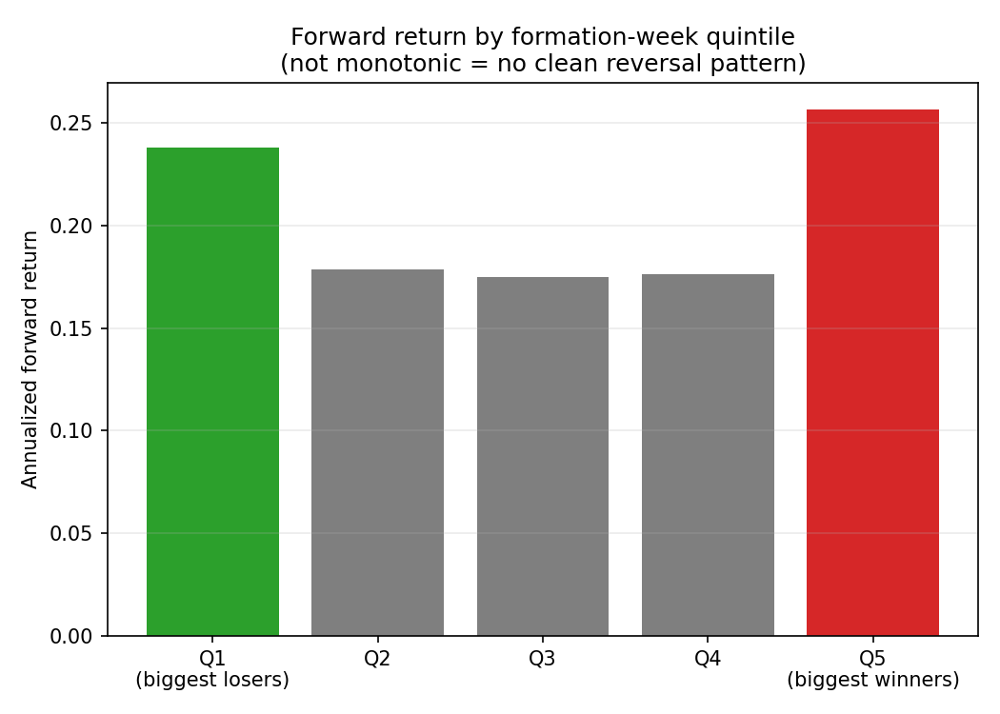

# Short-Term Reversal: A Cross-Sectional Mean-Reversion Backtest

A weekly-rebalanced, long-losers/short-winners equity strategy across 40
liquid US large caps, backtested with the statistical checks needed to
tell a real edge from noise.

## Why this project

Short-term reversal (Jegadeesh, 1990) is one of the most replicated
cross-sectional equity factors: stocks that fell the most over the past
week tend to partially bounce back, and the biggest weekly winners tend
to partially give some back - a pattern generally attributed to
short-term overreaction and to market makers being compensated for
absorbing one-sided order flow. It's a genuinely different mean-reversion
mechanism from the pairs-trading project elsewhere in this series (which
bets on a *specific pair's* cointegrated spread reverting) - here the bet
is cross-sectional: every week, rank all 40 stocks against each other and
trade the two tails.

## Universe and data

40 liquid US large-cap stocks spanning tech, financials, energy, health
care, consumer, and industrials (e.g. AAPL, JPM, XOM, JNJ, KO, CAT - full
list in `reversal.py`), 10 years of daily closes via Yahoo Finance.

## Construction

1. **Formation**: each week, rank all 40 stocks by their trailing 5-day
   (1 trading week) return.
2. **Portfolio**: long the bottom quintile (biggest recent losers), short
   the top quintile (biggest recent winners), equal-weighted within each
   leg, dollar-neutral.
3. **Holding period**: 1 week, then re-rank and rebalance.
4. Position applied with a 1-day lag after formation (no look-ahead).
5. **Costs**: 5 bps per leg on turnover at each rebalance.

## Results



| | n (days) | Annualized Sharpe | SE (Sharpe) | t-stat | Max DD | Total return |
|---|---|---|---|---|---|---|
| Train | 1,758 | -0.212 | 0.379 | -0.56 | -55.9% | -39.6% |
| Test | 754 | -0.385 | 0.578 | -0.67 | -48.0% | -29.9% |

**95% block-bootstrap CI for the test-period Sharpe: [-1.26, +0.38].**
Wide, straddles zero, and the t-stats on both periods are far below the
~2.0 usually wanted for statistical significance. This strategy, in this
form, on this universe and period, shows no real edge.

## Parameter robustness: no formation window is reliably good



Formation windows from 3 to 20 trading days were tested. The result is
not just "always negative" - it's **unstable in a specific way**: train
and test Sharpe move in *opposite* directions across the grid (the
10-day window is the worst on train but the best on test; the 3-5 day
windows are the least bad on train but the worst on test). A parameter
that looks good in-sample is not a useful guide here at all - which is a
stronger and more useful finding than a flat "everything is bad" result,
because it specifically rules out "just pick a different formation
window" as a fix.

## Quintile breakdown: the failure has a clear diagnosis



Splitting the universe into 5 quintiles by formation-week return and
looking at each quintile's own forward return shows **why** the strategy
lost money: the pattern isn't the monotonically decreasing one that a
clean reversal effect would produce (losers outperforming, winners
underperforming, in a straight line across all 5 buckets). Instead it's
U-shaped - both tails (biggest losers *and* biggest winners) outperform
the middle three quintiles, and the winners' quintile (+25.7%
annualized) is if anything slightly *ahead* of the losers' quintile
(+23.8%). That's mild momentum at the top, not reversal - which is
exactly what a long-losers/short-winners strategy is positioned to lose
money on.

## Interpretation

This is consistent with a well-known feature of the reversal literature:
the effect is strongest in periods and universes with high idiosyncratic
dispersion and weaker (or reversed) during strong, narrow, momentum-led
bull markets - and mega-cap US equities over the past decade, especially
the 2019-2025 window dominated by a handful of large-cap tech names, is
close to the textbook case of the latter. The "biggest weekly winners" in
this sample were disproportionately momentum names that kept winning,
not names that had over-reacted and were due to mean-revert.

## Limitations

- **Universe is 40 large, liquid mega-caps** - short-term reversal is
  typically documented as stronger in smaller, less liquid names, where
  overreaction is less efficiently arbitraged away. Testing on large caps
  specifically stacks the deck against finding the effect, by design (it's
  the more conservative, tradeable-at-scale universe, not the one most
  likely to show the academic effect at its strongest).
  - **iid assumption in the analytical Sharpe SE** (Lo, 2002) - the block
  bootstrap (40 trading days ~ 8 weeks) is the more reliable check for
  that reason, and is the one used for the headline confidence interval.
- **Quintile cutoffs (20%) and weekly holding are fixed choices**, not
  optimized - by design, to avoid tuning on the same data used to
  evaluate the strategy.
- **No sector or beta neutrality beyond the long/short dollar-neutral
  construction** - a market-neutral overlay (hedging residual beta) was
  not tested here.

## Next iteration

Test the same construction on a small/mid-cap universe, where the
literature suggests the effect is more likely to survive transaction
costs, and compare directly against this large-cap result to isolate
whether liquidity/size, rather than the reversal mechanism itself, is
the deciding factor.

## Usage

```bash
pip install -r requirements.txt
python reversal.py        # runs the backtest, robustness grid, bootstrap
python plot_reversal.py
```

## Stack

Python, pandas, numpy, yfinance, matplotlib.
